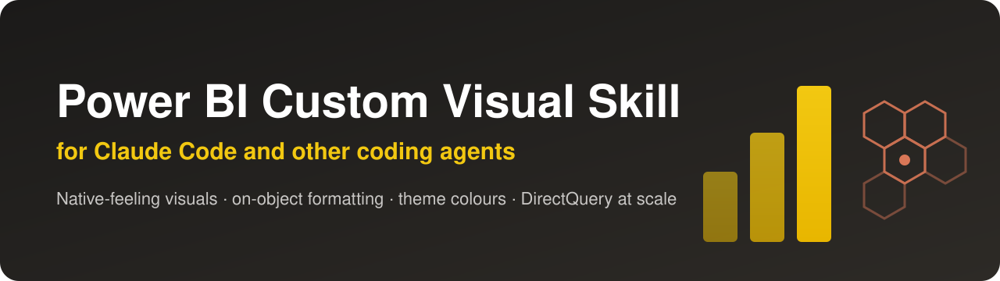

<p align="center">
  
</p>

<h1 align="center">Power BI Custom Visual Skill for Claude Code</h1>

<p align="center">
  <b>Build Power BI custom visuals that behave like native ones: cross-filtering, report theme colours,
  on-object formatting, a clean format pane, and maps that stay fast on billion-row DirectQuery models.</b>
</p>

<p align="center">
  <a href="LICENSE"></a>
  <a href="https://github.com/Lesleybs2/powerbi-custom-visual-skill/stargazers"></a>
  <a href="https://github.com/Lesleybs2/powerbi-custom-visual-skill/commits/main"></a>
  
  
</p>

---

## Table of contents

- [What it does](#what-it-does)
- [Who is this for](#who-is-this-for)
- [Installation](#installation)
- [Usage](#usage)
- [What's inside](#whats-inside)
- [Design philosophy](#design-philosophy)
- [Proven in production](#proven-in-production)
- [Contributing](#contributing)
- [Author](#author)

## What it does

The Power BI visuals SDK gets a chart on the screen. Getting that chart to *feel native* is where the time
goes, and most of the answers are nowhere in the docs. This skill takes Claude Code (or any coding agent)
from `pbiviz new` to a visual you would put next to Microsoft's own: the build order, plus every trap that
cost real time, with its fix.

| You hit this | The skill tells you |
|---|---|
| Clicking a part in format mode opens the wrong card, or nothing | The four things that must line up for on-object formatting: the `Visual-` card prefix, unique part names, matching sub-selection types, handlers that step aside |
| Your colours ignore the report theme, or the colour pickers do nothing | Which palette member matches which native element, and how to fill defaults so the author's pick still wins |
| The format pane is a wall of settings | Cards cut by job, sections, header switches, hiding what a different choice makes meaningless, per-field settings |
| The visual quietly shows only part of the data | Data reduction, `fetchMoreData` windows, and why a mapping without a reduction is capped low |
| "The query exceeds the maximum of 1,000,000 rows" on DirectQuery | Why one measure breaks the TOP-N pushdown, and how to load detail on demand with a self filter |
| Maps crawl with thousands of shapes | Canvas rendering, dots for small shapes, reference layers from storage instead of the model |
| The package won't build, or CI fails where your laptop works | Toolchain versions that work together, and the one to pin |
| It worked in the developer visual but breaks once installed | A jsdom render harness that tests the packaged bundle, and a real install-and-screenshot loop |

## Who is this for

- **Power BI developers** who need a visual the native gallery does not have and want it to feel built in.
- **BI teams** maintaining custom visuals across many reports, who want them to follow the report theme and
  survive upgrades.
- **Anyone using an AI coding agent** for Power BI work: the skill gives the agent the knowledge it does not
  have out of the box, so it stops guessing property names and fighting the host.

## Installation

### Claude Code plugin (recommended)

```
/plugin marketplace add Lesleybs2/powerbi-custom-visual-skill
/plugin install powerbi-custom-visual@powerbi-custom-visual-skill
```

### Any coding agent (skills CLI)

```bash
npx skills add Lesleybs2/powerbi-custom-visual-skill
```

### Manual

```bash
git clone https://github.com/Lesleybs2/powerbi-custom-visual-skill.git
cp -r powerbi-custom-visual-skill/plugins/powerbi-custom-visual/skills/create-powerbi-custom-visual ~/.claude/skills/
```

Not using an agent at all? [`SKILL.md`](plugins/powerbi-custom-visual/skills/create-powerbi-custom-visual/SKILL.md)
is plain Markdown: read it as a field guide and checklist.

**Requirements** for the visuals you build: Node.js 18+, `powerbi-visuals-tools` (pbiviz), and Power BI
Desktop on Windows for the install-and-verify loop.

## Usage

### Slash command

```
/create-powerbi-custom-visual
```

### Natural language

The skill loads by itself when you ask for something it covers, for example:

- *"Build a Power BI custom visual that shows a ranked, paged table with images."*
- *"My custom visual's colours ignore the report theme. Fix it."*
- *"Clicking the title in format mode opens the wrong card."*
- *"Add a heat map mode to my map visual without hitting the DirectQuery row limit."*
- *"Make the format pane of my visual look like a native one."*

### Scripts

```bash
# install the newest build into a PBIR report folder (refuses while Desktop is open)
node scripts/install-into-report.js <MyReport.Report> [dist/visual.pbiviz]

# confirm Desktop's "multiple data sources" prompt during unattended runs (Windows)
powershell -File scripts/Confirm-OpenPrompt.ps1
```

## What's inside

```
plugins/powerbi-custom-visual/skills/create-powerbi-custom-visual/
├── SKILL.md                      the guide: 12 steps, a checklist, every trap with its fix
├── reference/
│   ├── render-harness.js         jsdom harness with a complete fake Power BI host
│   └── on-object.ts              on-object formatting wiring, with the four traps marked
└── scripts/
    ├── install-into-report.js    installs the newest .pbiviz into a PBIR report
    └── Confirm-OpenPrompt.ps1    confirms Desktop's "multiple data sources" prompt
```

The twelve steps: settle the shape → a scaffold that builds → capabilities → reading the dataView → the format
pane → rendering → theme colours → interactions → on-object formatting → a render harness → install and
verify in Desktop → big data on DirectQuery → a visual repo that stays healthy.

## Design philosophy

**Borrow the host's machinery, never invent your own.** Colours come from the host palette, selection goes
through the selection manager, settings through the formatting model, format pane navigation through the
sub-selection API. Anything invented instead of borrowed looks and behaves like a stranger on the page.

**Compute over the whole set, display a subset.** Ranks, shares and maxima are computed over every row; only
then are rows dropped for search or paging.

**Prove it by rendering.** Structural validation passes on visuals that render blank. Every rule here ends in
a screenshot or a test against the packaged bundle, not in a JSON check.

**Respect the query.** On large models the visual's single query is the budget: keep it pushed down to the
source and let the visual ask for detail only where the reader looks.

## Proven in production

Every rule was earned on visuals in daily use:

- **A paged, ranked table** with on-object formatting, per-field settings and theme-following colours.
- **A map on a DirectQuery model of more than a billion rows.** It draws hundreds of thousands of locations,
  loads exact detail only when you zoom in, switches between heat map and bubbles, draws H3 clusters, and
  overlays reference layers from cloud storage without adding a single query to the report.

## Contributing

Found another trap, or a version that no longer works? Open an issue or a pull request; see
[CONTRIBUTING.md](CONTRIBUTING.md). The bar is the same as for the rest of the guide: a rule, the reason
behind it, and the fix.

## Author

Built by **Lesley Silbernberg**, Head of Data and analytics engineer, specialised in **Power BI and
Databricks**, and in putting **AI to work in data teams**. Lesley builds scalable data teams and systems for
start-ups and scale-ups: end to end from the lakehouse to the report, with CI/CD for Power BI and AI agents
that do real engineering work alongside the team.

This skill is what that looks like in practice: an AI coding agent that builds production Power BI visuals,
because the knowledge it needs was written down for it. Power BI that performs at scale, tooling that makes a
team faster, and nothing anyone has to learn twice.

**Work with Lesley.** Getting started with dashboards and a data warehouse, want a second pair of eyes on a
Power BI or Databricks setup, or looking to bring AI into how your team works: AI-assisted development,
agents and skills for your own stack, or automating the processes around your data? Lesley takes on focused
engagements, from a few hours of hands-on help to a complete project.

<a href="https://www.linkedin.com/in/%F0%9F%9A%80lesley-silbernberg-1a632433/"></a>

If this saved you an afternoon, a ⭐ helps other Power BI developers find it.

## License

[MIT](LICENSE)
